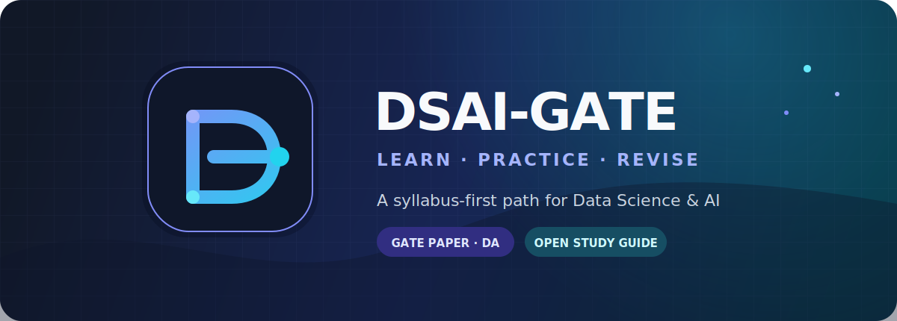

<div align="center">
  

  <br>

  <a href="https://gate2026.iitg.ac.in/doc/GATE2026_Syllabus/DA_2026_Syllabus.pdf"></a>
  <a href="../../PYQ/README.md"></a>
  <a href="../../notebooks/README.md"></a>
  <a href="../../LICENSE"></a>

  <p><strong>A focused, community-maintained study path for the GATE Data Science and Artificial Intelligence paper.</strong></p>

  <p>
    <a href="#study-map">Study map</a> ·
    <a href="#recommended-flow">Recommended flow</a> ·
    <a href="#exam-at-a-glance">Exam snapshot</a> ·
    <a href="#contributing">Contribute</a>
  </p>
</div>

> [!NOTE]
> Start with the official syllabus, learn from primary sources, and use
> previous-year papers to decide what to revise next.

## Study Map

<table>
  <tr>
    <td width="50%" valign="top">
      <h3>Foundations</h3>
      <p><a href="../../Probability-Statistics-Readme.md"><strong>Probability &amp; Statistics</strong></a><br>Distributions, inference, probability, and hypothesis tests.</p>
      <p><a href="../../Linear-Algebra-Readme.md"><strong>Linear Algebra</strong></a><br>Matrices, systems, eigenvalues, projections, SVD, and PCA.</p>
      <p><a href="../../Calculus-and-Optimization-Readme.md"><strong>Calculus &amp; Optimization</strong></a><br>Limits, derivatives, Taylor series, extrema, and optimization.</p>
    </td>
    <td width="50%" valign="top">
      <h3>Computing</h3>
      <p><a href="../../Programming-and-Algorithms-Readme.md"><strong>Programming &amp; Algorithms</strong></a><br>Python, data structures, searching, sorting, trees, and graphs.</p>
      <p><a href="../../Database-Management-Readme.md"><strong>Database Management</strong></a><br>Relational models, SQL, normalization, indexing, and warehousing.</p>
    </td>
  </tr>
  <tr>
    <td width="50%" valign="top">
      <h3>Intelligence</h3>
      <p><a href="../../Machine-Learning-Readme.md"><strong>Machine Learning</strong></a><br>Regression, classification, validation, clustering, and dimensionality reduction.</p>
      <p><a href="../../Artificial-Intelligence-Readme.md"><strong>Artificial Intelligence</strong></a><br>Search, logic, reasoning under uncertainty, and inference.</p>
    </td>
    <td width="50%" valign="top">
      <h3>Practice</h3>
      <p><a href="../../notebooks/README.md"><strong>Focused Notebooks</strong></a><br>Small examples that connect theory, implementation, and GATE-style questions.</p>
      <p><a href="../../PYQ/README.md"><strong>Official Papers &amp; Keys</strong></a><br>Verified repository copies of the 2024-2026 DA papers.</p>
      <p><a href="../../docs/official-resources.md"><strong>Primary Resources</strong></a><br>Official and university-hosted courses, references, and exam research.</p>
    </td>
  </tr>
</table>

## Recommended Flow


<details>
<summary><strong>New to the syllabus?</strong></summary>

1. Read the [official syllabus](https://gate2026.iitg.ac.in/doc/GATE2026_Syllabus/DA_2026_Syllabus.pdf).
2. Begin with foundations: probability, linear algebra, and programming.
3. Use the subject guides to select one primary learning resource.
4. Attempt official questions only after learning the underlying concept.

</details>

<details>
<summary><strong>Preparing for revision?</strong></summary>

1. Attempt a previous-year paper under timed conditions.
2. Group mistakes by syllabus topic.
3. Revisit the relevant subject guide and focused notebook.
4. Practice across MCQ, MSQ, and NAT formats.

</details>

## Exam At A Glance

<div align="center">

| `DA` | `3 HOURS` | `100 MARKS` | `MCQ · MSQ · NAT` |
| :---: | :---: | :---: | :---: |
| Paper code | Duration | Total marks | Question types |

</div>

| Section | Marks | Notes |
| --- | ---: | --- |
| General Aptitude | 15 | Common GATE aptitude section |
| Data Science and AI | 85 | Questions across the seven syllabus areas |

MCQs have negative marking; MSQs and NATs do not. Always verify the current
rules on the [official paper-pattern page](https://gate2026.iitg.ac.in/question-paper-pattern.html).

## Repository Map

```text
dsai-gate/
├── *-Readme.md          Subject-wise study guides
├── notebooks/           Focused examples and collaborator notebooks
├── PYQ/                 Official papers, answer keys, and checksums
├── Topic_Resources/     Topic-specific supporting material
├── Interview/           Material beyond the core exam path
├── Data/                Reference files and learning assets
└── docs/                Research, policy, planning, and maintenance
```

<div align="center">
  <a href="../../notebooks/README.md"><strong>Explore notebooks</strong></a>
  ·
  <a href="../../PYQ/README.md"><strong>Open official papers</strong></a>
  ·
  <a href="../../docs/official-resources.md"><strong>Browse primary resources</strong></a>
</div>

## Contributing

Good contributions are **syllabus-aligned**, **legally shareable**, and
**easy to verify**.

| Before submitting | Expected check |
| --- | --- |
| Add or update educational content | Name the official syllabus topic it supports |
| Add a resource | Prefer an official, author, publisher, or university source |
| Add a notebook | Run it from a clean kernel and include GATE-style practice |
| Add a local file or link | Verify that the path resolves |
| Add an official paper | Update `PYQ/README.md` and `PYQ/SHA256SUMS` |

Read the [repository agent guide](../../docs/agent.md) before making substantial
changes.

## Project Direction

<table>
  <tr>
    <td><a href="../../docs/implementation_plan.md"><strong>Implementation plan</strong></a><br>Current delivery phases and planned notebooks.</td>
    <td><a href="../../docs/future_directions.md"><strong>Future directions</strong></a><br>Minimal roadmap for reliability, coverage, and navigation.</td>
  </tr>
  <tr>
    <td><a href="../../docs/official-resources.md"><strong>Official research</strong></a><br>Exam facts, paper analysis, and primary learning sources.</td>
    <td><a href="../../docs/stale-links.md"><strong>Stale-link audit</strong></a><br>Known link problems and replacement guidance.</td>
  </tr>
</table>

---

<div align="center">
  <sub>Built for deliberate preparation: learn the concept, test the reasoning, then revise the gap.</sub>
</div>
